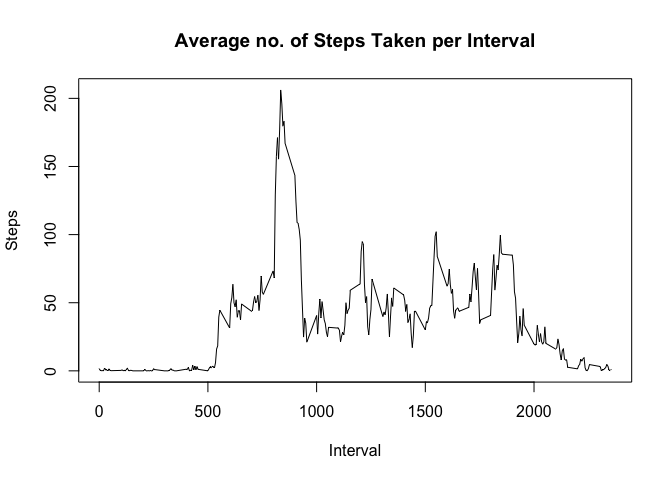

# Reproducible Research: Peer Assessment 1


## Loading and preprocessing the data
I read the data into R with the standard read.csv() function. Thereafter,I changed the date variable into a date format, as it was loaded as factors by default.

```r
activity<-read.csv("activity.csv",header=TRUE)
activity$date=as.Date(activity$date)
```

### What is mean total number of steps taken per day?
For this part I ignored the missing values of the data set, which are dealt with later. To make a histogram of the total number of steps taken each day, I used the tapply() function, which splits data by variables and then applies functions to them - the mean in this case. Furthermore, I calculated the mean and median of total number of steps taken per day, and stored them in variables.

```r
total_StepsPerDay=tapply(activity$steps,activity$date,sum,na.rm=TRUE)
hist(total_StepsPerDay,breaks=30,main="Total Number of Steps per Day",xlab="Steps")
```

<!-- -->

```r
(mean_StepsPerDay=tapply(activity$steps,activity$date,mean,na.rm=TRUE))
```

```
## 2012-10-01 2012-10-02 2012-10-03 2012-10-04 2012-10-05 2012-10-06 
##        NaN  0.4375000 39.4166667 42.0694444 46.1597222 53.5416667 
## 2012-10-07 2012-10-08 2012-10-09 2012-10-10 2012-10-11 2012-10-12 
## 38.2465278        NaN 44.4826389 34.3750000 35.7777778 60.3541667 
## 2012-10-13 2012-10-14 2012-10-15 2012-10-16 2012-10-17 2012-10-18 
## 43.1458333 52.4236111 35.2048611 52.3750000 46.7083333 34.9166667 
## 2012-10-19 2012-10-20 2012-10-21 2012-10-22 2012-10-23 2012-10-24 
## 41.0729167 36.0937500 30.6284722 46.7361111 30.9652778 29.0104167 
## 2012-10-25 2012-10-26 2012-10-27 2012-10-28 2012-10-29 2012-10-30 
##  8.6527778 23.5347222 35.1354167 39.7847222 17.4236111 34.0937500 
## 2012-10-31 2012-11-01 2012-11-02 2012-11-03 2012-11-04 2012-11-05 
## 53.5208333        NaN 36.8055556 36.7048611        NaN 36.2465278 
## 2012-11-06 2012-11-07 2012-11-08 2012-11-09 2012-11-10 2012-11-11 
## 28.9375000 44.7326389 11.1770833        NaN        NaN 43.7777778 
## 2012-11-12 2012-11-13 2012-11-14 2012-11-15 2012-11-16 2012-11-17 
## 37.3784722 25.4722222        NaN  0.1423611 18.8923611 49.7881944 
## 2012-11-18 2012-11-19 2012-11-20 2012-11-21 2012-11-22 2012-11-23 
## 52.4652778 30.6979167 15.5277778 44.3993056 70.9270833 73.5902778 
## 2012-11-24 2012-11-25 2012-11-26 2012-11-27 2012-11-28 2012-11-29 
## 50.2708333 41.0902778 38.7569444 47.3819444 35.3576389 24.4687500 
## 2012-11-30 
##        NaN
```

```r
(median_StepSPerDay=tapply(activity$steps,activity$date,median,na.rm=TRUE))
```

```
## 2012-10-01 2012-10-02 2012-10-03 2012-10-04 2012-10-05 2012-10-06 
##         NA          0          0          0          0          0 
## 2012-10-07 2012-10-08 2012-10-09 2012-10-10 2012-10-11 2012-10-12 
##          0         NA          0          0          0          0 
## 2012-10-13 2012-10-14 2012-10-15 2012-10-16 2012-10-17 2012-10-18 
##          0          0          0          0          0          0 
## 2012-10-19 2012-10-20 2012-10-21 2012-10-22 2012-10-23 2012-10-24 
##          0          0          0          0          0          0 
## 2012-10-25 2012-10-26 2012-10-27 2012-10-28 2012-10-29 2012-10-30 
##          0          0          0          0          0          0 
## 2012-10-31 2012-11-01 2012-11-02 2012-11-03 2012-11-04 2012-11-05 
##          0         NA          0          0         NA          0 
## 2012-11-06 2012-11-07 2012-11-08 2012-11-09 2012-11-10 2012-11-11 
##          0          0          0         NA         NA          0 
## 2012-11-12 2012-11-13 2012-11-14 2012-11-15 2012-11-16 2012-11-17 
##          0          0         NA          0          0          0 
## 2012-11-18 2012-11-19 2012-11-20 2012-11-21 2012-11-22 2012-11-23 
##          0          0          0          0          0          0 
## 2012-11-24 2012-11-25 2012-11-26 2012-11-27 2012-11-28 2012-11-29 
##          0          0          0          0          0          0 
## 2012-11-30 
##         NA
```


## What is the average daily activity pattern?
As a next step, we shall create a time series plot which evaluates the average number of steps taken, averaged across all days by the 5-minute intervals. Again, the data was processed with the tapply() function for this. Also, we shall assess which 5-minute interval, on average across all the days in the dataset, contains the maximum number of steps. This is interval 835 with 206.2 steps.

```r
mean_StepsPerInterval=tapply(activity$steps,activity$interval,mean,na.rm=TRUE)
intervals=split(activity,activity$date=="2012-10-01")[[2]][,3]
plot(mean_StepsPerInterval~intervals,main="Average no. of Steps Taken per Interval",
     xlab="Interval",ylab="Steps",type="l")
```

<!-- -->

```r
sort(mean_StepsPerInterval)[length(mean_StepsPerInterval)]
```

```
##      835 
## 206.1698
```


## Imputing missing values
Missing values are a problem introduced in most realistic data-sets and need to be dealt with accordingly. First, I found that 2304 rows contained missings. Second, I applied a bootstrap re-sampling with replacement method, which imputed the missing values. This new data set is called activity.bootNA. Lastly, I repeated the steps performed in "What is mean total number of steps taken per day?". In the histogram containing missing values these were treated as zeroes, thus yielding in a peak there. This effect vanished in the imputed histogram and overall the plot looked more normally distributed as well. This effect is also noticeable in the mean() and median() calculations on the imputed data-set.

```r
nrow(activity)-sum(complete.cases(activity))
```

```
## [1] 2304
```

```r
# Replace NA's in data with bootstrapping from predictor
activity.bootNA<-activity
for(j in 1:ncol(activity.bootNA)){
    for(i in 1:nrow(activity.bootNA)){
        if(is.na(activity.bootNA[i,j])){
            activity.bootNA[i,j]=sample(x=na.omit(activity.bootNA[,j]),size=1,replace=TRUE)
        }
    }
}
rm(i,j)

total_StepsPerDay.bootNA=tapply(activity.bootNA$steps,activity.bootNA$date,sum)
hist(total_StepsPerDay.bootNA,breaks=30,main="Histogram of Total Number of Steps per Day (imputed)",xlab="Number of Steps")
```

<!-- -->

```r
(mean_StepsPerDay.bootNA=tapply(activity.bootNA$steps,activity.bootNA$date,mean))
```

```
## 2012-10-01 2012-10-02 2012-10-03 2012-10-04 2012-10-05 2012-10-06 
## 40.7118056  0.4375000 39.4166667 42.0694444 46.1597222 53.5416667 
## 2012-10-07 2012-10-08 2012-10-09 2012-10-10 2012-10-11 2012-10-12 
## 38.2465278 35.0763889 44.4826389 34.3750000 35.7777778 60.3541667 
## 2012-10-13 2012-10-14 2012-10-15 2012-10-16 2012-10-17 2012-10-18 
## 43.1458333 52.4236111 35.2048611 52.3750000 46.7083333 34.9166667 
## 2012-10-19 2012-10-20 2012-10-21 2012-10-22 2012-10-23 2012-10-24 
## 41.0729167 36.0937500 30.6284722 46.7361111 30.9652778 29.0104167 
## 2012-10-25 2012-10-26 2012-10-27 2012-10-28 2012-10-29 2012-10-30 
##  8.6527778 23.5347222 35.1354167 39.7847222 17.4236111 34.0937500 
## 2012-10-31 2012-11-01 2012-11-02 2012-11-03 2012-11-04 2012-11-05 
## 53.5208333 31.9479167 36.8055556 36.7048611 42.6875000 36.2465278 
## 2012-11-06 2012-11-07 2012-11-08 2012-11-09 2012-11-10 2012-11-11 
## 28.9375000 44.7326389 11.1770833 39.5173611 38.1145833 43.7777778 
## 2012-11-12 2012-11-13 2012-11-14 2012-11-15 2012-11-16 2012-11-17 
## 37.3784722 25.4722222 36.4166667  0.1423611 18.8923611 49.7881944 
## 2012-11-18 2012-11-19 2012-11-20 2012-11-21 2012-11-22 2012-11-23 
## 52.4652778 30.6979167 15.5277778 44.3993056 70.9270833 73.5902778 
## 2012-11-24 2012-11-25 2012-11-26 2012-11-27 2012-11-28 2012-11-29 
## 50.2708333 41.0902778 38.7569444 47.3819444 35.3576389 24.4687500 
## 2012-11-30 
## 45.4340278
```

```r
(median_StepSPerDay.bootNA=tapply(activity.bootNA$steps,activity.bootNA$date,median))
```

```
## 2012-10-01 2012-10-02 2012-10-03 2012-10-04 2012-10-05 2012-10-06 
##          0          0          0          0          0          0 
## 2012-10-07 2012-10-08 2012-10-09 2012-10-10 2012-10-11 2012-10-12 
##          0          0          0          0          0          0 
## 2012-10-13 2012-10-14 2012-10-15 2012-10-16 2012-10-17 2012-10-18 
##          0          0          0          0          0          0 
## 2012-10-19 2012-10-20 2012-10-21 2012-10-22 2012-10-23 2012-10-24 
##          0          0          0          0          0          0 
## 2012-10-25 2012-10-26 2012-10-27 2012-10-28 2012-10-29 2012-10-30 
##          0          0          0          0          0          0 
## 2012-10-31 2012-11-01 2012-11-02 2012-11-03 2012-11-04 2012-11-05 
##          0          0          0          0          0          0 
## 2012-11-06 2012-11-07 2012-11-08 2012-11-09 2012-11-10 2012-11-11 
##          0          0          0          0          0          0 
## 2012-11-12 2012-11-13 2012-11-14 2012-11-15 2012-11-16 2012-11-17 
##          0          0          0          0          0          0 
## 2012-11-18 2012-11-19 2012-11-20 2012-11-21 2012-11-22 2012-11-23 
##          0          0          0          0          0          0 
## 2012-11-24 2012-11-25 2012-11-26 2012-11-27 2012-11-28 2012-11-29 
##          0          0          0          0          0          0 
## 2012-11-30 
##          0
```


## Are there differences in activity patterns between weekdays and weekends?
As a final step, I assessed whether differences in activity patterns exist between weekdays and weekends. To achieve this, I added a new column to the original data set called dayType with the levels "weekday" and "weekend". I believe this is elegantly done with the use of the packages data.table and lubridate, so I loaded those beforehand. Then I plotted a panel plot similar to the time series plot in "What is the average daily activity pattern?", but this time separated by weekdays and weekends. It seems as if weekends contribute to more steps than weekdays.

```r
library(data.table)
library(lubridate)
```

```
## 
## Attaching package: 'lubridate'
```

```
## The following objects are masked from 'package:data.table':
## 
##     hour, isoweek, mday, minute, month, quarter, second, wday,
##     week, yday, year
```

```
## The following object is masked from 'package:base':
## 
##     date
```

```r
activity_dayType=as.data.table(activity)
activity_dayType[,dayType:={ifelse(wday(date)==1|wday(date)==7,'weekend','weekday')}]
activity_weekday=subset(activity_dayType,dayType %in% 'weekday')
activity_weekend=subset(activity_dayType,dayType %in% 'weekend')

mean_StepsPerInterval_weekday=tapply(activity_weekday$steps,activity_weekday$interval,mean,na.rm=TRUE)
mean_StepsPerInterval_weekend=tapply(activity_weekend$steps,activity_weekend$interval,mean,na.rm=TRUE)

par(mfrow=c(2,1))
plot(mean_StepsPerInterval_weekday~intervals,main="Weekdays",
     xlab="Interval",ylab="Number of Steps",type="l")
plot(mean_StepsPerInterval_weekend~intervals,main="Weekends",
     xlab="Interval",ylab="Number of Steps",type="l")
```

<!-- -->

